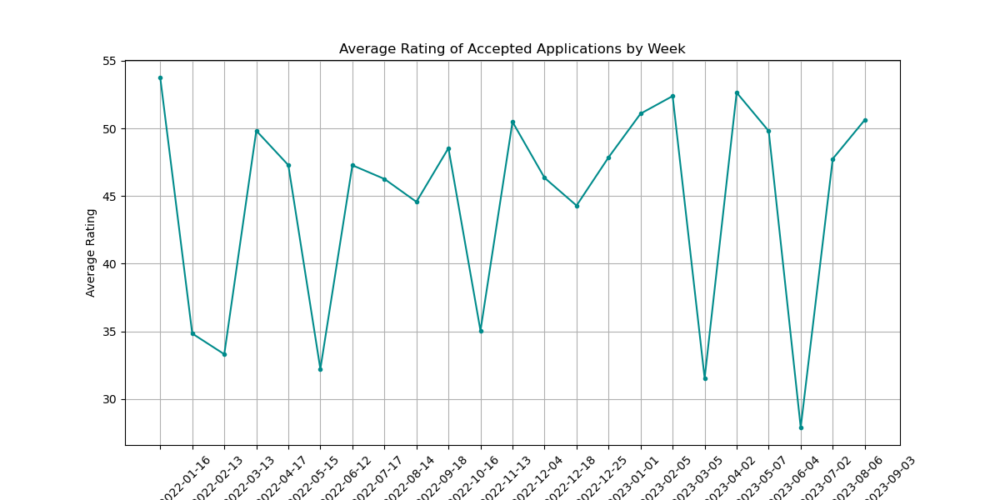

# 📊 Application Scoring Analysis

## Overview
This project involves analyzing and scoring applications based on various criteria using Python and Pandas. The objective is to clean, process, and score the applications, and then analyze the results by grouping the data by the week in which the application was submitted. The project also includes visualizing the average score of accepted applications for each week.

## Project Steps

### 1. Data Loading and Cleaning
- **Objective:** Load the `applications.csv` data into a Pandas DataFrame and clean it by removing duplicates and filling missing values.
- **Steps:**
  - Remove duplicate `applicant_id` data.
  - Fill missing values in the 'External Rating' field with zeros.
  - Fill missing values in the 'Education level' field with "Average".

### 2. Merging Industry Data
- **Objective:** Add industry points from the `industries.csv` file to the applications DataFrame.
- **Steps:**
  - Merge the `applications.csv` and `industries.csv` DataFrames based on the appropriate key.

### 3. Application Rating Calculation
- **Objective:** Calculate the application rating based on multiple criteria, with a score ranging from 0 to 100.
- **Scoring Criteria:**
  - **Age Criteria:** 20 points for candidates aged 35 to 55.
  - **Submission Day Criteria:** 20 points for applications submitted on weekdays.
  - **Marital Status Criteria:** 20 points for married candidates.
  - **Location Criteria:** 10 points for candidates living in Warsaw or the Masovian Voivodeship.
  - **Industry Score:** Add the industry score from the `industries.csv` table (0 to 20 points).
  - **External Rating Criteria:** 
    - 20 points for an 'External Rating' of 7 or higher.
    - -20 points for an 'External Rating' of 2 or lower.
  - **Score Validation:** If the 'Amount' value is missing or the 'External Rating' is zero, the rating is set to zero.

### 4. Filtering Accepted Applications
- **Objective:** Retain only applications with a score greater than zero in the results table.

### 5. Weekly Grouping and Visualization
- **Objective:** Group the accepted applications by the week in which they were submitted and visualize the average score per week.
- **Visualization:**
  - A graph showing the average score of accepted applications for each week.

## 🚀 Results
- **Application Scoring:** The project successfully scored applications based on the defined criteria, filtered out unqualified applications, and provided a weekly analysis of accepted applications.
- **Visualization:** The average score of accepted applications for each week was visualized to provide insights into the scoring trends over time.

## 📂 Project Files
- **Jupyter Notebook:** [Applications Analysis.ipynb](Applications.ipynb)
- **Data Files:**
  - `applications.csv`: The primary dataset containing application details.
  - `industries.csv`: The dataset containing industry scores.

## 📊 Visualizations
- **Weekly Average Score of Accepted Applications:**
  

## 🛠️ Tools Used
- **Python:** For data processing and analysis.
- **Libraries:** Pandas, Matplotlib, Seaborn, NumPy.

